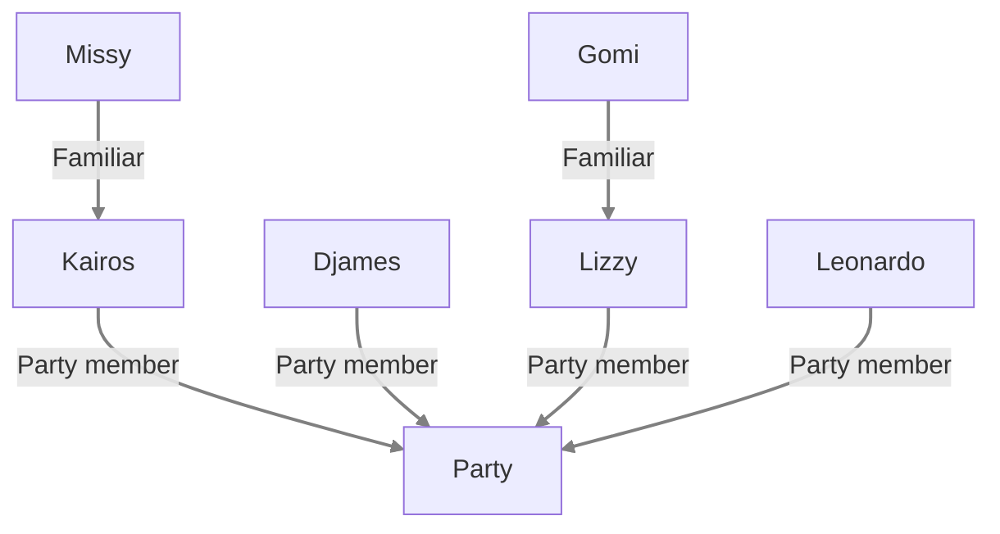

---
tags:
  - Player
aliases: []
---
# Party
[[Kairos]]
- [[Clowy]]
- [[Tempo]]
[[Djames]]
- [[Governor]]
- [[Djames-Horse]]
[[Leonardo|Leonardo]]
- [[Leonardos-Horse]]
[[Lizzy-the-Leshby|Lizzy]]
- [[Gomi]]
- [[Lizzys-Horse]]

We also have a packing mule, [[Rucio]]. Rucio is quick to panic in battle, and flees at the first sign. Rucio can carry 18 bulk in weight: any bulk below 1 is treated as L-bulk (meaning: A Large creature treats 10 items of 1 Bulk as 1 Bulk). Any actual L bulk is treated as negligble. 
# Relations

