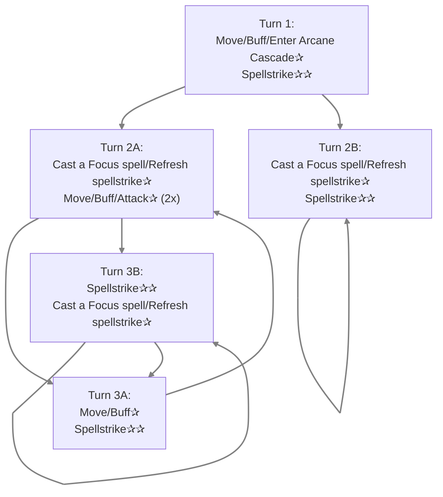

[Stellaris](../../Creatures/Party-Members/Stellaris.md) Basic Rotation:

```mermaid
graph
  1["Turn 1:</br>Move/Buff/Enter Arcane Cascade✰</br>Spellstrike✰✰"];
  2a["Turn 2A:</br>Cast a Focus spell/Refresh spellstrike✰</br>Move/Buff/Attack✰ (2x)"];
  2b["Turn 2B:</br>Cast a Focus spell/Refresh spellstrike✰</br>Spellstrike✰✰"];
  3a["Turn 3A:</br>Move/Buff✰</br>Spellstrike✰✰"];
  3b["Turn 3B:</br>Spellstrike✰✰</br>Cast a Focus spell/Refresh spellstrike✰"];
  1 --> 2a;
  1 --> 2b;
  2a --> 3a;
  2a --> 3b;
  2b --> 2b;
  3a --> 2a;
  3b --> 3b;
  3b --> 3a;

linkStyle default stroke-width:2px,fill:none,stroke:gray;
```

**Beware: 2B and 3B can be negative scenario's, since you're taking the Multiple Attack Penalty on your second action** 